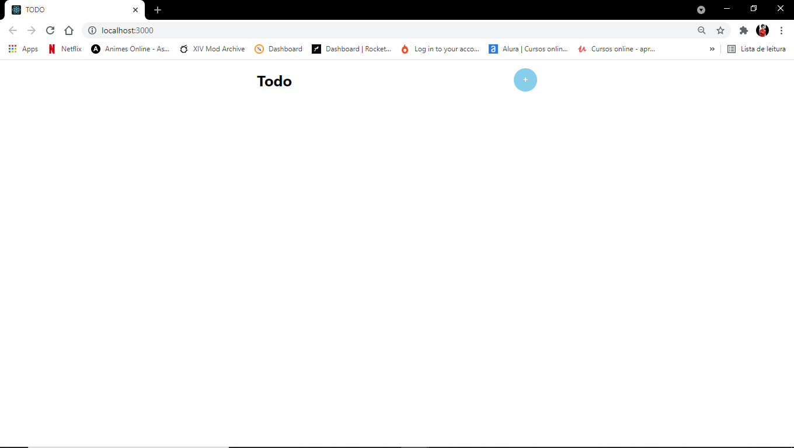
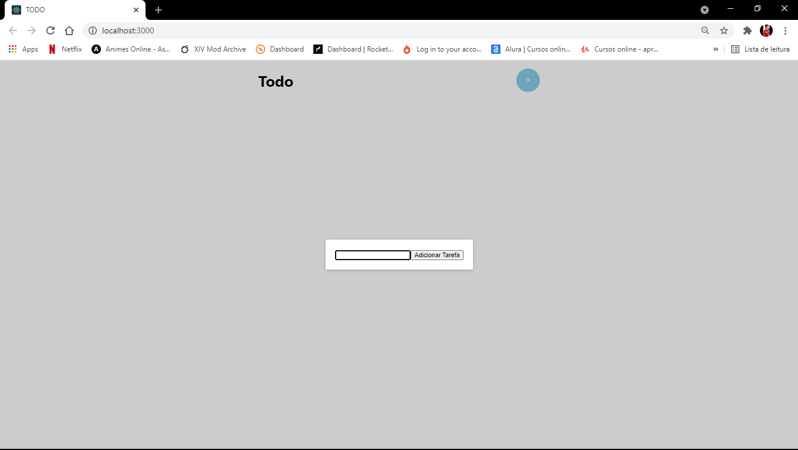
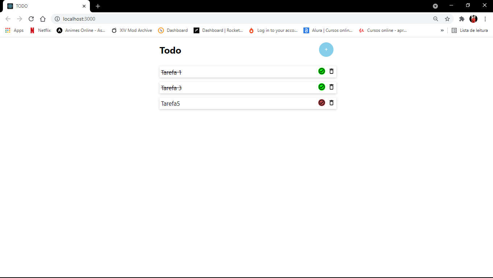

<h1 align="center">
  TODO with React.js
</h1>

  <a href="#-project">Project</a>&nbsp;&nbsp;&nbsp;|&nbsp;&nbsp;&nbsp;
  <a href="#-technologies">Technologies</a>&nbsp;&nbsp;&nbsp;|&nbsp;&nbsp;&nbsp;
  <a href="#-services-used">Services Used</a>&nbsp;&nbsp;&nbsp;|&nbsp;&nbsp;&nbsp;
  <a href="#-getting-started">Getting Started</a>&nbsp;&nbsp;&nbsp;|&nbsp;&nbsp;&nbsp;
  <a href="#-how-to-use">How To Use</a>&nbsp;&nbsp;&nbsp;|&nbsp;&nbsp;&nbsp;
  <a href="#-features">Features</a>&nbsp;&nbsp;&nbsp;|&nbsp;&nbsp;&nbsp;
  <a href="#memo-license">License</a>

 

  

 

## 💻 Project

TODO with React.js is a project based on create online tasks list.

  

## 🚀 Technologies

This project was developed using these techs:

- [React](https://reactjs.org)

 

## 👨‍🔧 Services Used

- GitHub

 

## 🎮 Getting Started

If you want run this code, you can start cloning the repository using HTTP or SSH key.

- Open your gitBash (git terminal)
- Type `git clone`
- Insert the HTTP or SSH key (on windows, shift + insert to paste on gitBash)
- You can find this HTTP or SSH Key by clicking on `Code` on the top right in this repository

- Once cloned you can open the project in your IDE and enter the codes below in the IDE terminal

`yarn` To add the dependencies on the project.

`yarn start` Runs the app in the development mode.\
Open [http://localhost:3000](http://localhost:3000) to view it in the browser.

 

## 📌 How to Use

### 1 - When you access the project, you will see the home page. In this page you can:
#### 1.1 - Add a new task by clicking on `+` button
#### 1.2 - Remove a task
#### 1.3 - Mark a task as done

### 2 - When `+` button is clicked, a modal will be displayed for the task to be entered

### 2 - Tasks marked as done will be crossed out.

 

### Have you prepared your to-do list? Time to get your hands dirty!

 

## 🕵 Features

The main features of the application are:
 - Storage of added tasks in localStorage
 - Add a task
 - Remove a task
 - Mark a task as done
 
 

## :memo: License

This project is under MIT license.

 

 > In case of sensitive bugs like security vulnerabilities, please contact
 > <a href = "mailto:deywerson.pereira@gmail.com">deywerson.pereira@gmail.com</a> directly instead of using issue tracker. We value your effort
 > to improve the security and privacy of this project!
  
 
---
  

      
Please follow on github and join us! Thanks for visiting me and good coding!

Made with ♥ by <a href="https://github.com/deywersonp">Deywerson Pereira</a>
